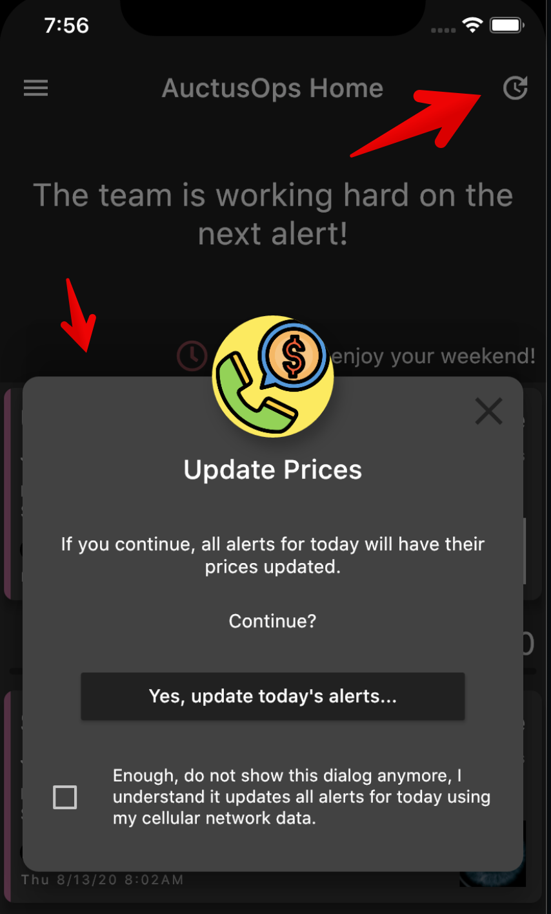
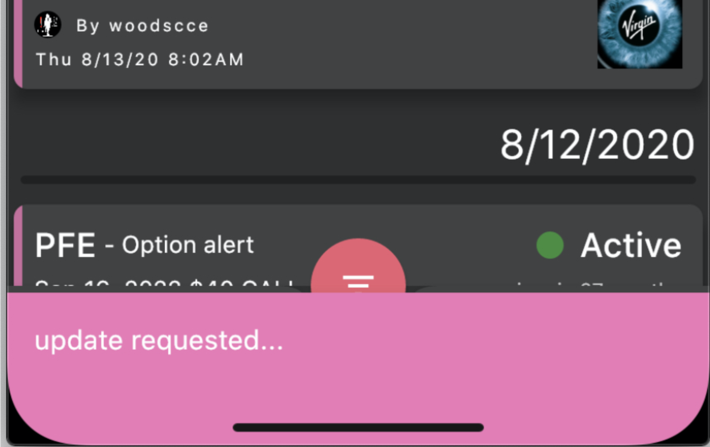
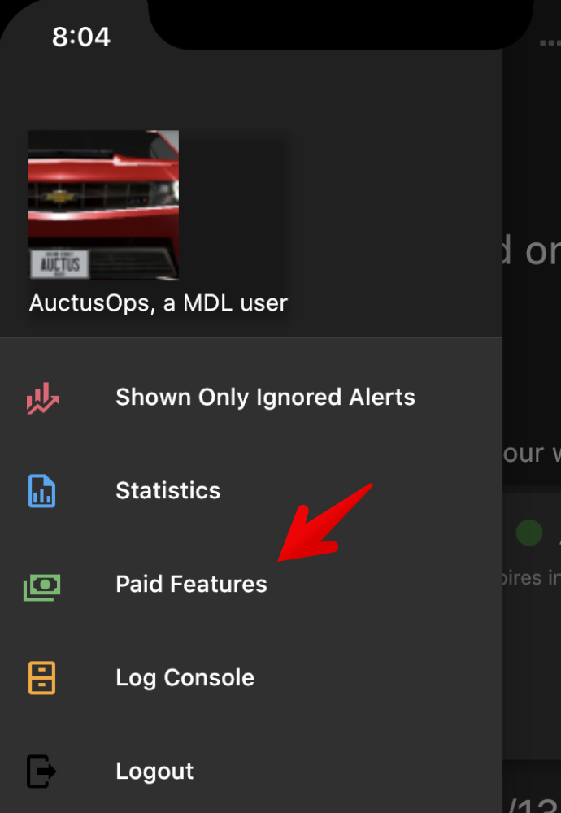
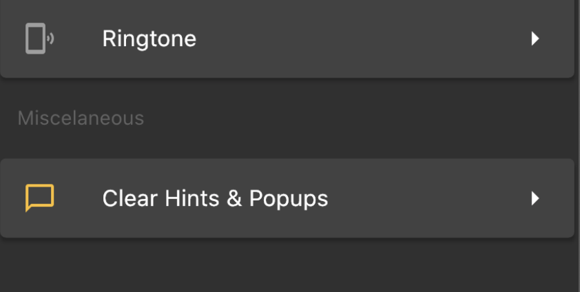
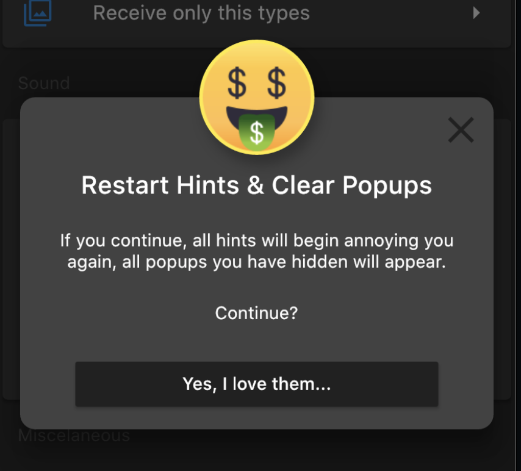
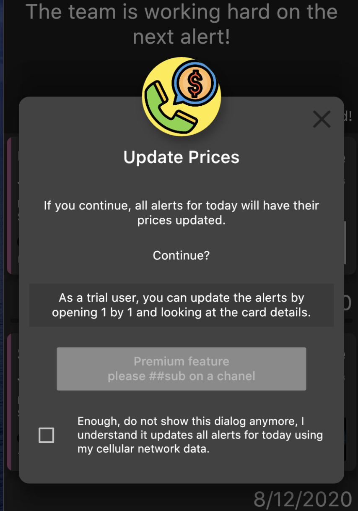

# Updating Ticker Prices for a paid member

> trial users see next section

If you tap on the update icon (see top red arrow), a popup like below will appear:

{:width="350px"}

The will update the "Equity Price" of all today's alerts.

If you are fed up with the popup, you can tap the bottom checkbox so it does not appear anymore.
Just a toast will appear below when you press it, like this:
{:width="350px"}

I you want to get the popup back, you can go to Paid Features Menu:
{:width="350px"}

and access the "Clear Hints & Popups" menu entry:
{:width="350px"}

The dialog that opens is self explanatory:
{:width="350px"}

# Updating Ticker Prices for trial users

Trial users will se this dialog, asking them to `##sub`:
{:width="350px"}
